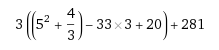

## 1.2. Arithmetic Operations
### 演算子
Pythonで用いることのできる，主な演算子は以下の通りです．

|演算子|概要|
|:-:|:-:|
|`+`|加算|
|`-`|減算|
|`*`|乗算|
|`**`|べき乗|
|`/`|除算|
|`//`|除算(切り捨て)|
|`%`|剰余|

以下のようにすることで，電卓としても活用することができます．

```python
>>> 9 + 4
13
>>> 9 - 4
5
>>> 9 * 4
36
>>> 9 ** 4
6561
>>> 9 / 4
2.25
>>> 9 // 4
2
>>> 9 % 4
1
```

また，`()`を用いることで，演算の順序を入れ替えることもできます．

なお，Pythonにはインクリメント演算子(`++`)やデクリメント演算子(`--`)は存在しません．  
後述の累算代入文を利用してください．

### Practice
- 以下の計算式を計算してください．  



- 2進数32桁で表現できる数は何種類ですか？